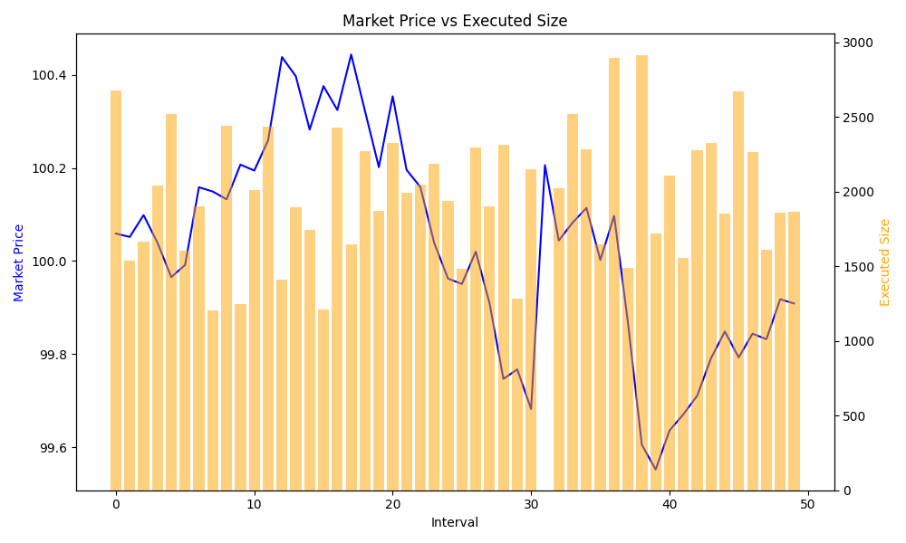
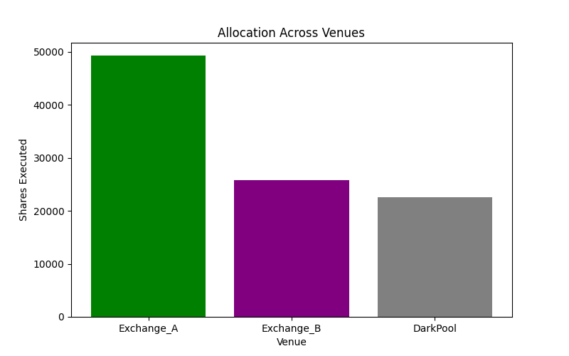
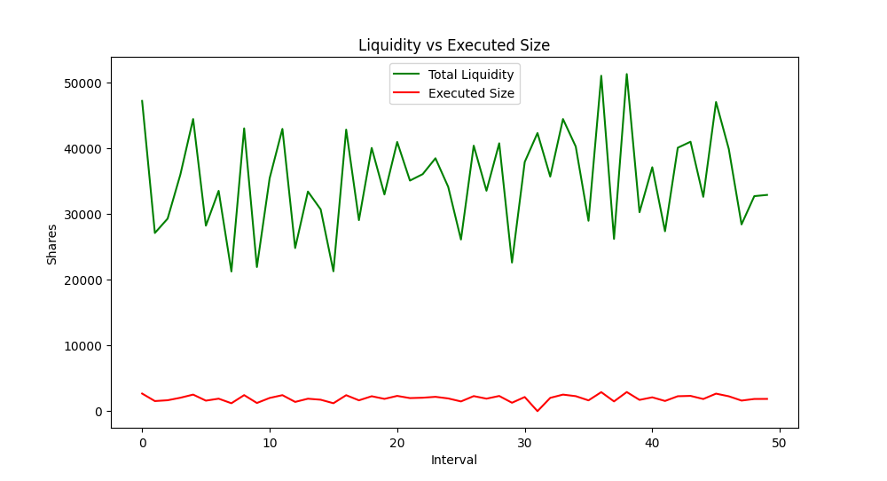

# Order Placing Strategy
This strategy uses best of the both worlds. TWAPs and VWAPs to mitigate signaling risk and slippage. This strategy also uses multiple venues to place multiple orders simultaneously with low market impact. Signaling risk is also mitigated by iceberg technique used here  

## Total Executed Shares: 97,574
- Average Execution Price: $99.72
- Benchmark VWAP: $100.01
- Benchmark TWAP: $100.03
+ Strategy beat both VWAP and TWAP benchmarks.

## 1. Order Size vs Market Price

## 2. Allocation across multiple venues

## 3. Order Size vs Liquidity
